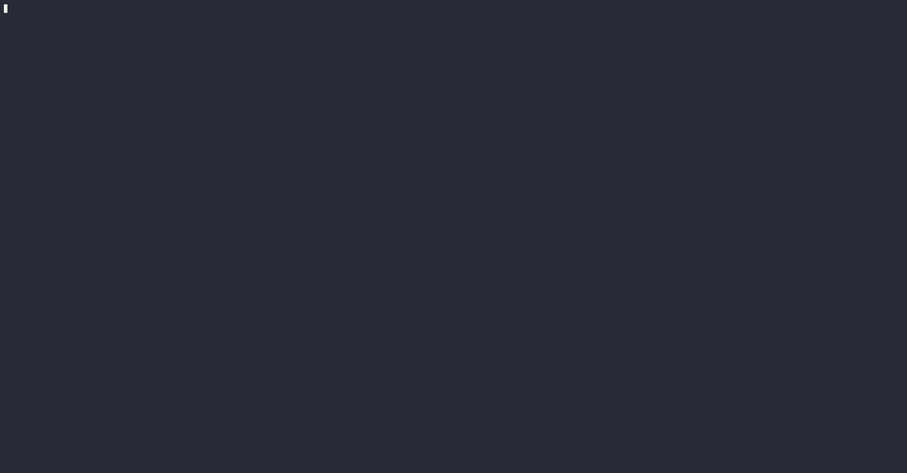

# 🪇 clacker

Browse Hacker News inside Claude Code.

If your company doesn't like you wasting the afternoon on Hacker News but
doesn't mind you wasting it in Claude Code, then browse Hacker News in Claude
Code. No tokens get spent, because there's no model. clacker runs a local
server that impersonates the Anthropic API and answers every request itself
with a `match` statement.



## Install

Requires [Claude Code](https://claude.com/claude-code) on your `PATH`, since
clacker launches it for you.

```sh
git clone https://github.com/LudeeD/clacker
cd clacker
cargo install --path .
```

## Use it

```sh
clacker
```

Claude Code opens. Talk to it normally:

| Say | Get |
| --- | --- |
| `front page` | Top stories (also `new`, `best`, `ask`, `show`, `jobs`) |
| `3` | Read story 3 from the current list |
| `comments 3` | That story's thread |
| `more` | Next page |
| `search rust async` | Search Hacker News |
| `help` | The list above |

`3`, `the third one`, and `open the discussion on 3` all land in the same
place. Anything that doesn't parse as a command becomes a search.

## How it works

Four moving parts:

1. **A local server** binds an ephemeral port and speaks the Anthropic Messages
   API: `/v1/messages`, streaming SSE frames and all.
2. **Claude Code launches** with `ANTHROPIC_BASE_URL` pointed at that server, so
   every request goes to your loopback interface instead of Anthropic.
   `ANTHROPIC_API_KEY` gets stripped from the environment so nothing can leak
   out to the real API.
3. **The "model"** is a pure function from transcript to reply. It reads what
   you typed, picks a tool, formats what comes back.
4. **The tools are real.** clacker also runs as a stdio MCP server that Claude
   Code spawns itself (`clacker mcp`), fetching from the Hacker News Firebase
   and Algolia APIs. Those tool calls scrolling past in your transcript are
   genuinely dispatched by the harness. Nothing about them is decided by a
   model.

Your own MCP servers stay out of the session (`--strict-mcp-config`), and only
the Hacker News tools are allowed. A Hacker News session has no business
touching your codebase.

## Other commands

```sh
clacker --harness claude   # pick a harness explicitly
clacker serve              # run just the fake API, for poking at with curl
clacker mcp                # the MCP server, if you want it standalone
CLACKER_DEBUG=1 clacker    # log unhandled requests
```

## License

MIT. See [LICENSE](LICENSE).
